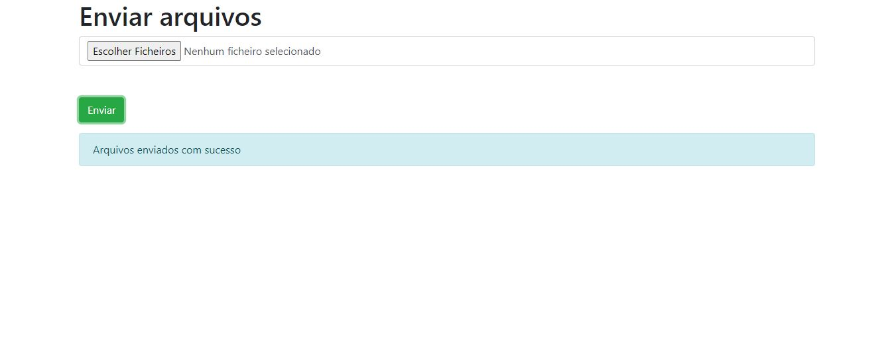

# Upload Múltiplos com PHP e AJAX

## Sobre o projecto

Esse exemplo de formulário com upload de arquivos simples ou múltiplos utilizando PHP e AJAX é uma solução eficiente para permitir que os usuários enviem vários arquivos de uma só vez.